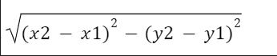

# REG-NO: 212223230071
# NAME: HARISH S
# DISTANCE-BETWEEN-TWO-POINTS

## AIM:
To write a python program to find the distance two 2 points
## ALGORITHM:
### Step 1: 
Using import math function,do the calculations.
### Step 2: 
Take the two coordinates as l1 and l2.
### Step 3: 
Substitute the values in the distance formula


### Step 4: 
using the print function, display the distance between the two points.
### Step 5: 
End the program.
### PROGRAM:
```
import math
def calculate_distance(point1, point2):
    x1, y1 = point1
    x2, y2 = point2
    distance = math.sqrt((x2 - x1)**2 + (y2 - y1)**2)
    return distance
point1 = [4, 2]
point2 = [10, 6]
distance = calculate_distance(point1, point2)
print("{:.2f}".format(distance))

```
  
### OUTPUT:


### RESULT:
Thus the distance of the two points is sucessfully executed and displayed.
